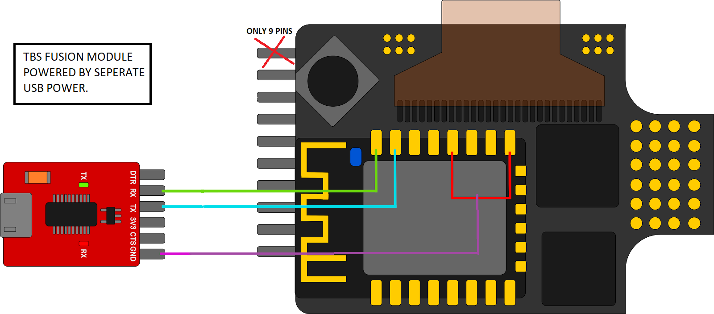

# HDZero Goggles

## Analog Modules

### ImmersionRC RapidFire
The ImmersionRC RapidFire is considered by some to be the best analog module on the market. It is a dual receiver module that uses advanced algorithms to combine the best parts of two analog signals into one. Using [Paul Kendall's mod](https://github.com/pkendall64/hdzero-goggle/wiki/Analog-Module-Backpack-Control), it is possible to control the RapidFire module with the HDZero goggles. This will allow you to use the ELRS VTX Administrator functionality or the jog dial on the goggles to change channels and change between rapidFIRE in the goggles menu.

[ImmersionRC Product Page](https://www.immersionrc.com/fpv-products/rapidfire/)

### TBS Fusion

A popular analog module for goggles with a Fatshark compatible module bay is the TBS Fusion. Similar to the ImmersionRC Rapidfire, it uses "active video fusion" to reduce image breakup and increase usable video range. While it has a Wifi backpack, out of the box it does not work with the ELRS VTX Administrator functionality. However, it is possible to flash the module with ELRS backpack firmware, which will allow you to use the Fusion with ELRS.

[TBS Product Page](https://www.team-blacksheep.com/products/prod:tbs_fusion)

#### ELRS Backpack Flashing

!!! info
    You will need a FTDI or similar USB UART/serial adapter in order to flash the Fusion. You can find them on Amazon or eBay for a few dollars if you do not have one already.

!!! warning
    This process requires you to lift the LCD screen on the Fusion. This is not a difficult process, but you should be careful not to damage the ribbon cable or the screen itself. The easiest way to do this is by powering up the module by USB, letting it run for a minute or two until it has warmed up, thus softening the adhesive. You should now be able to gently remove the display, flip it over, and now have access to the connection points underneath.

Wire up your TBS Fusion as shown below: 

Power the module using a seperate USB connection, created a ground bridge between pins 15/18 (red) and the FTDI GND (purple), and connected the RX and TX respectively via FTDI. Put the module into Bootloader by holding the button to the left and powered it up. The screen should now show "wifi unbrick".

Then, use the ELRS configurator to build and install the backpack directly onto the module (UART method). After it was successful, disconnect all wires and put it back together.

You should be able to get the Fusion to start up the ELRS wifi page by using the ELRS Lua transmitter script (`Wifi Connectivity -> Enable VRx WiFI`). The Fusion should then show the wireless signal as no longer broken on its OSD. You should also be able to view the elrs_vrx.local page (if you gave it your home wifi credentials or are connected to its ELRS hotspot).

!!! note
    You can repeat the last section in the future to update the fusion backpack wirelessly.

The last step is to enable everything on the Fusion. Goto `Settings -> VTX Sync -> "Follow"`, and you should be good to go!

