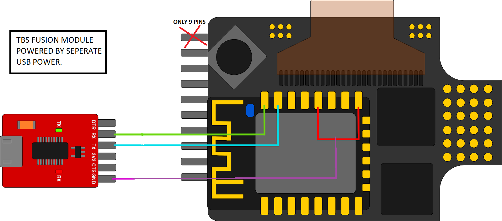

# TBS Fusion

## ELRS Backpack Flashing

Wire up your TBS Fusion as shown below: 

Power the module using a seperate USB connection, created a ground bridge between pins 15/18 (red) and the FTDI GND (purple), and connected the RX and TX respectively via FTDI. Put the module into Bootloader by holding the button to the left and powered it up. The screen should now show "wifi unbrick". 

Then, use the ELRS configurator to build and install the backpack directly onto the module (UART method). After it was successful, disconnect all wires and put it back together. You should be able to get the Fusion to start up the ELRS wifi page by using the transmitter lua script (`Wifi Connectivity -> Enable VRx WiFI`). The Fusion should then showed wireless signal as no longer broken on its OSD. You should also be able to view the elrs_vrx.local page (if you gave it your home wifi credentials or are connected to it's ELRS network). You can now update the fusion backpack wirelessly for the future.

Last step was to enable everything on the Fusion. Goto `Settings -> VTX Sync -> "Follow"`

!!! note

    Thanks to Lixx for the above instructions. [SOURCE](https://discord.com/channels/949936394036457482/949936394036457485/1111148866352467968)
