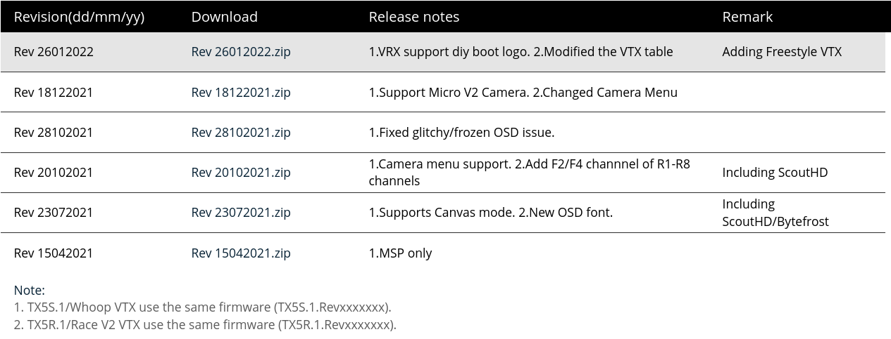
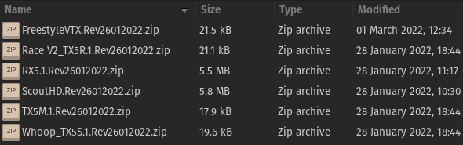
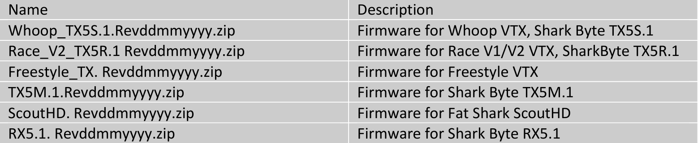

#Updating an HDZero VTX

The firmware files can be downloaded from [here](https://www.hd-zero.com/document){target=_blank}.

##Firmware

Each revision contains firmware for all VTX and VRX. The revision number is formatted as 
rev_ddmmyyy.zip, where "ddmmyyy" indicates the date of release. 

Contents of each revision:

##VTX Update Guide
The zip file for each VTX contains HDZERO_TX.bin. 
###Steps to Update VTX firmware
1. Format your microSD card (Choose FAT32 and Allocation Unit size to 
4096 bytes)
2. Power off your VRX if it is already on. 
3. Copy the HDZERO_TX.bin file from corresponding VTX zip file onto your microSD card, and 
insert the microSD card into the VRX module.
4. Connect one end of your Firmware Update Cable to the VRX and the other end to the VTX you want to update.
5. Make sure to connect the mini-HDMI cable to your VRX and to your goggles/screen to see the firmware update progress.
6. Power on the VRX module.
7. If you get the "Wait to Connect VTX" or "Check Cable..." message, make sure that you did  step 4 right.
8. If you get the "Firmware update failed" message, repeat the procedure from step 1. 
9. If you get the "Firmware update successful" message, you are set.
10. HDZERO_TX.bin file is automatically removed after a successful update.

**Handy Tip**: If you create an empty file named "DONOTREMOVE.txt" in the root directory of the microSD card, HDZERO_TX.bin will not be removed after each successful update. This is convenient when you update several VTXes in succession.
